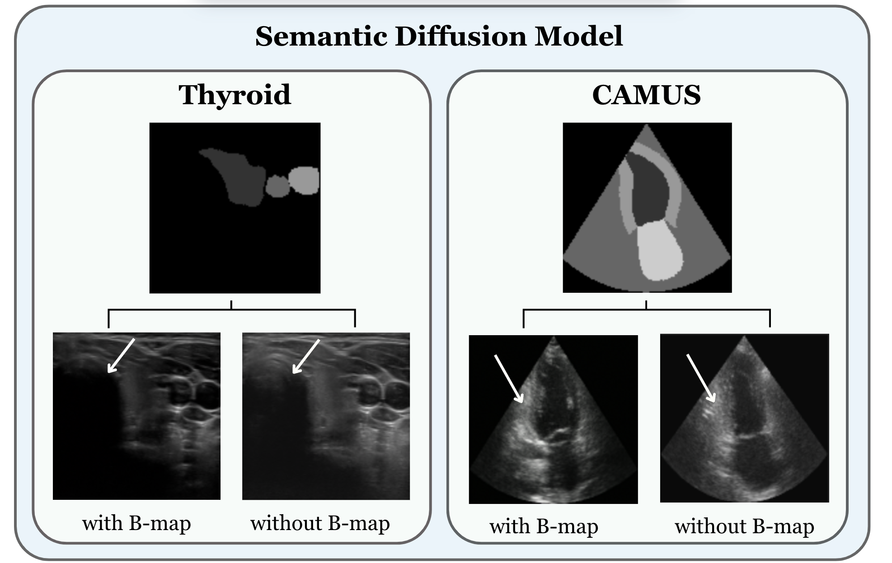
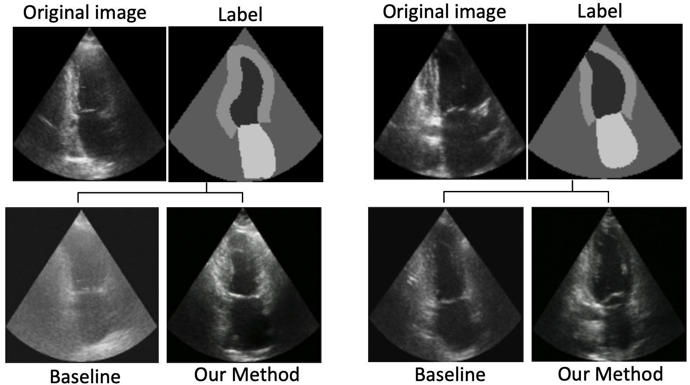
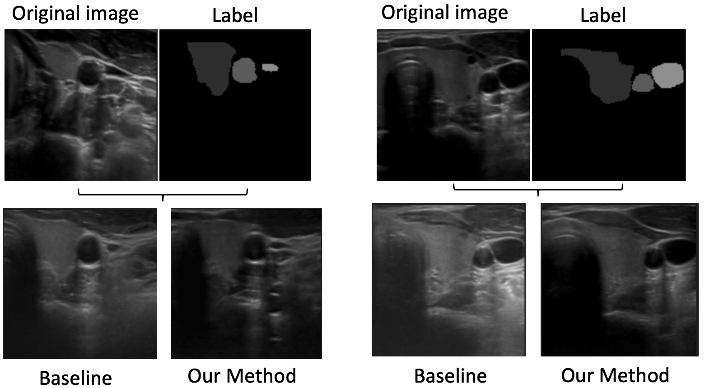

# Diffusion as Sound Propagation: Physics-inspired Model for Ultrasound Image Generation &middot; [](http://makeapullrequest.com) [](https://github.com/marinadominguez/diffusion-for-us-images/blob/main/LICENSE) 

&nbsp;

  

## Cite this work

```
@misc{domínguez2024diffusionsoundpropagationphysicsinspired,
      title={Diffusion as Sound Propagation: Physics-inspired Model for Ultrasound Image Generation}, 
      author={Marina Domínguez and Yordanka Velikova and Nassir Navab and Mohammad Farid Azampour},
      year={2024},
      eprint={2407.05428},
      archivePrefix={arXiv},
      primaryClass={eess.IV},
      url={https://arxiv.org/abs/2407.05428}, 
}
```

## Papers

### [Diffusion as Sound Propagation: Physics-inspired Model for Ultrasound Image Generation](https://doi.org/10.48550/arXiv.2407.05428)

[Marina Domínguez](https://scholar.google.com/citations?hl=en&view_op=list_works&gmla=ALUCkoUmoNFKeWJpBKMIKg1oPcr9mi40bkt-fYDgi9oy5EydUt3lajYPkMce28dZYyUpqseasvyY7Umu44zbyQ&user=WnjMdXkAAAAJ), [Yordanka Velikova](https://scholar.google.com/citations?user=-N2d-8QAAAAJ&hl=en&oi=ao), [Nassir Navab](https://scholar.google.com/citations?user=kzoVUPYAAAAJ&hl=en&oi=ao), [Mohammad Farid Azampour](https://scholar.google.com/citations?user=MQcHEBsAAAAJ&hl=en&oi=ao)

### [Echo from noise: synthetic ultrasound image generation using diffusion models for real image segmentation Paper](https://link.springer.com/chapter/10.1007/978-3-031-44521-7_4)

[David Stojanovski](https://scholar.google.com/citations?user=6A_chPAAAAAJ&hl=en), [Uxio Hermida](https://scholar.google.com/citations?hl=en&user=6DkZyrXMyKEC), [Pablo Lamata](https://scholar.google.com/citations?hl=en&user=H98n1tsAAAAJ), [Arian Beqiri](https://scholar.google.com/citations?hl=en&user=osD0r24AAAAJ&view_op=list_works&sortby=pubdate), [Alberto Gomez](https://scholar.google.com/citations?hl=en&user=T4fP_swAAAAJ&view_op=list_works&sortby=pubdate)

### [Semantic Diffusion Model Paper](https://arxiv.org/abs/2207.00050)

[Weilun Wang](https://scholar.google.com/citations?hl=zh-CN&user=YfV4aCQAAAAJ), [Jianmin Bao](https://scholar.google.com/citations?hl=zh-CN&user=hjwvkYUAAAAJ), [Wengang Zhou](https://scholar.google.com/citations?hl=zh-CN&user=8s1JF8YAAAAJ), [Dongdong Chen](https://scholar.google.com/citations?hl=zh-CN&user=sYKpKqEAAAAJ), [Dong Chen](https://scholar.google.com/citations?hl=zh-CN&user=_fKSYOwAAAAJ), [Lu Yuan](https://scholar.google.com/citations?hl=zh-CN&user=k9TsUVsAAAAJ), [Houqiang Li](https://scholar.google.com/citations?hl=zh-CN&user=7sFMIKoAAAAJ)

## Abstract

Deep learning (DL) methods typically require large datasets to effectively learn data distributions. However, in the medical field, data is often limited in quantity, and acquiring labeled data can be costly. To mitigate this data scarcity, data augmentation techniques are commonly employed. Among these techniques, generative models play a pivotal role in expanding datasets. However, when it comes to ultrasound (US) imaging, the authenticity of generated data often diminishes due to the oversight of ultrasound physics.

We propose a novel approach to improve the quality of generated US images by introducing a physics-based diffusion model that is specifically designed for this image modality. The proposed model incorporates an US-specific scheduler scheme that mimics the natural behavior of sound wave propagation in ultrasound imaging. Our analysis demonstrates how the proposed method aids in modeling the attenuation dynamics in US imaging. We present both qualitative and quantitative results based on standard generative model metrics, showing that our proposed method results in overall more plausible images.

## Example Results

The original ultrasound image is included here for comparison to better illustrate the differences between the synthetic image generated by the original SDM (baseline), the image generated using the modified SDM with our method, and the actual ultrasound image.

### Thyroid dataset

  

### CAMUS dataset

  

&nbsp;

## Prerequisites

- Linux
- Python 3
- CPU or NVIDIA GPU + CUDA CuDNN

## Dataset Preparation

To prepare the data, we recommend using the same process outlined in the [Echo from Noise repository](https://github.com/david-stojanovski/echo_from_noise). The data used is the CAMUS dataset and the Thyroid dataset, which can be downloaded and processed as follows:

### CAMUS Dataset

1. **Download CAMUS Data**:
    - The CAMUS data used for training and testing can be found [here](https://www.creatis.insa-lyon.fr/Challenge/camus/).

2. **Extract and Format the Data**:
    - You can use the scripts in the `data_preparation/` folder of the **echo_from_noise** repository:
        - Extract the data using `extract_camus_data.py`.
        - Augment the CAMUS labels using `augment_camus_labels.py`.

    Follow the instructions provided in the [data preparation section](https://github.com/david-stojanovski/echo_from_noise/tree/master/data_preparation) of the original repository.

### Thyroid Dataset

1. **Download Thyroid Data**:
    - The Thyroid dataset used for training and testing can be downloaded from [this link](https://www.cs.cit.tum.de/camp/publications/segthy-dataset/).

2. **US Thyroid Dataset**:
    - You can directly download the ultrasound data from [this link](https://www.campar.in.tum.de/public_datasets/2022_plosone_eilers/US_data.zip).

Once the datasets have been downloaded, make sure to organize and preprocess them according to the instructions in the corresponding dataset documentation.


# Semantic Diffusion Model

The default parameters for training and inference can be found in the `./semantic_diffusion_model/config.py` file. The original network our code is developed on can befound [here](https://github.com/WeilunWang/semantic-diffusion-model). In our implementation the minimum B-Map is set to 0.97, like this the Semantic Diffusion Model can be train with inclusion of B-Maps. The original network can also be trained by setting the minimum B-Map parameter to 1.

## Model Training

To train the Semantic Diffusion Model with the inclusion of b-maps, use the following command:

```bash
python3 ./image_train.py --savedir ./output \\
--batch_size_train 4 --is_train True --random_flip False \\
--deterministic_train False --use_fp16 True --distributed_data_parallel False \\
--img_size 128 --lr_anneal_steps 50000
```

## Model inference

To inference the model run:

```bash
python3 ./image_sample.py --resume_checkpoint ./path/to/ema_checkpoint.pt \\
--is_train False --inference_on_train True
```

## Checkpoints (Pretrained Models with our Method)
Pre-trained model checkpoints for generating the synthetic datasets with our method are available for download:

|Dataset       |Download link     |
|:-------------|:-----------------|
|CAMUS|[Checkpoint](https://drive.google.com/drive/folders/1JTdglDAZkDYkTTn_y72v7zyazG-t3Ya3?usp=sharing)|
|Thyroid |[Checkpoint](https://drive.google.com/drive/folders/1bIQp5WzRwyt2-J2IqFudNWVrRGyqFYKH?usp=sharing)|
